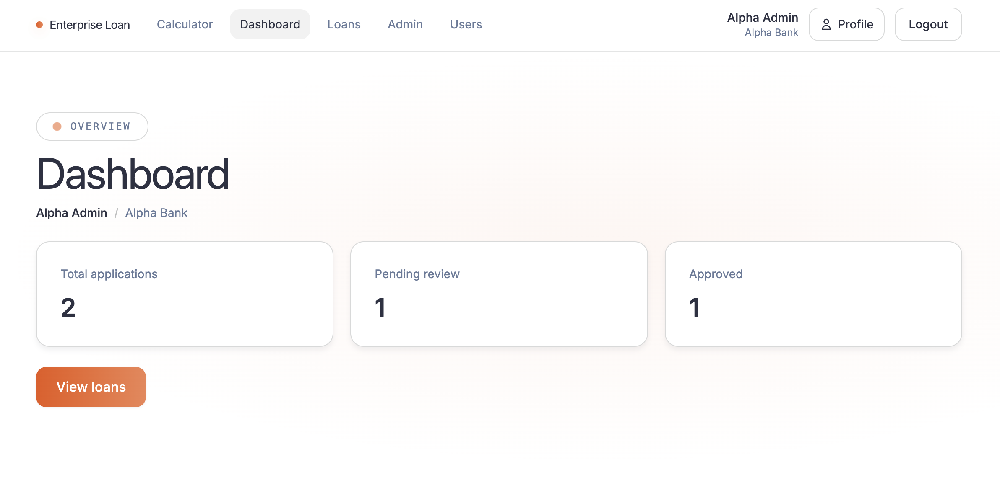
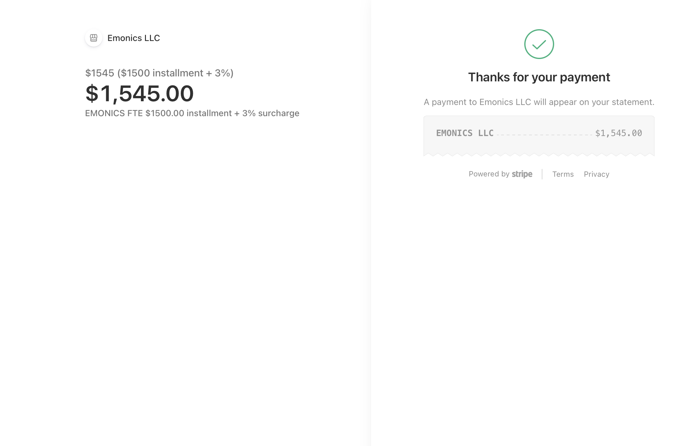

# ⚙️ Backend — Spring Boot 3.2 REST API
## Enterprise Loan Management Platform

This is the production-quality backend for the Enterprise Loan Management platform, built with Spring Boot 3.2. It provides a multi-tenant API for managing loans, users, and dynamic forms.

## 2. Business Domain Overview

The Enterprise Loan Management platform is a **SaaS solution** for financial institutions (Tenants). Each tenant operates in a completely isolated environment, managing their own user base (Applicants, Officers, Admins) and their unique loan application workflows.

The core of the platform is the **Loan Lifecycle**:
`DRAFT` → `SUBMITTED` → `UNDER_REVIEW` → `APPROVED / REJECTED / REFERRED` → `DISBURSED` → `REPAYING` → `CLOSED`.

## 🖼️ Visual Result
The backend powers complex, multi-tenant aware dashboards that reflect the state of every loan application in real-time.



### 💳 Disbursement & Stripe Integration
For approved loans, the system generates payment intents. Once disbursed, the user receives a confirmation powered by a clean, modern UI.



What makes this system unique is its **Schema-driven approach**. Rather than hardcoding loan forms, we store versioned JSON schemas in a `JSONB` column. This allows a tenant to update their entire application structure via the Admin panel—adding fields, changing validations, or modifying conditional logic—as a data operation, requiring no code deployment or service restart.

## 3. Backend Tech Stack

| Technology | Version | Purpose |
| :--- | :--- | :--- |
| **Java** | 21 | Language runtime |
| **Spring Boot** | 3.2 | Auto-configuration, embedded Tomcat |
| **Spring Security** | 6 | Authentication + authorization |
| **Spring Data JPA** | latest | Repository abstraction |
| **Hibernate** | 6 | ORM, PostgreSQL dialect |
| **PostgreSQL** | 16 | Primary datastore |
| **Flyway** | latest | Database migration management |
| **jjwt (JJWT)** | 0.12.3 | JWT generation, signing, validation |
| **BCrypt** | — | Password hashing (strength 12) |
| **Lombok** | latest | Boilerplate reduction (@Data, @Builder, etc.) |
| **Maven** | 3.9 | Build and dependency management |
| **Docker** | — | Containerized deployment |
| **Eclipse Temurin** | 21 Alpine | Slim production runtime image |

## 4. How to Run (Local — without Docker)
```bash
cd backend
# Set environment variables:
export DATABASE_URL=jdbc:postgresql://localhost:5432/loandb
export DATABASE_USER=loanapp
export DATABASE_PASSWORD=loanpass123
export JWT_SECRET=your-minimum-256-bit-secret-key-here

mvn spring-boot:run
# API available at http://localhost:8080/api/v1
```

## 5. How to Run (Docker)
```bash
# From project root:
docker-compose up --build backend
```

## 6. Project Structure — Full Annotated Tree

```text
src/main/java/com/loanapp/
├── LoanManagementApplication.java      ← Spring Boot entry point
│
├── config/
│   ├── SecurityConfig.java             ← Security filter chain, CORS, session policy
│   ├── CorsConfig.java                 ← Allows http://localhost:4200 in dev
│   └── JwtConfig.java                  ← Reads JWT_SECRET + expiry from application.yml
│
├── security/
│   ├── JwtTokenProvider.java           ← Generates + validates JWTs; extracts claims
│   ├── JwtAuthenticationFilter.java    ← OncePerRequestFilter; sets SecurityContext + TenantContext
│   └── UserDetailsServiceImpl.java     ← Loads UserDetails from DB; checks ACTIVE status
│
├── entity/
│   ├── Tenant.java                     ← Multi-tenant root; holds config_json (JSONB)
│   ├── User.java                       ← Platform user; linked to one Tenant
│   ├── FormSchema.java                 ← Versioned JSON schema per tenant + loan type
│   ├── LoanApplication.java            ← Core loan record with form_data (JSONB)
│   ├── WorkflowStep.java               ← Each review/approval step on an application
│   └── AuditLog.java                   ← Immutable event log for all state changes
│
├── repository/
│   ├── TenantRepository.java           ← findByDomainKey, findAll (public endpoint)
│   ├── UserRepository.java             ← findByEmailAndTenantId, existsByEmail
│   ├── FormSchemaRepository.java       ← findActiveByTenantIdAndLoanType
│   └── LoanApplicationRepository.java  ← findAllByTenantId, findAllByApplicantId (role-scoped)
│
├── service/
│   ├── AuthService.java                ← signup(), login(), refreshToken(), changePassword()
│   ├── FormSchemaService.java          ← getActiveSchema(), updateSchema() (increments version)
│   ├── LoanApplicationService.java     ← submit(), saveDraft(), getById(), updateStatus()
│   └── UserService.java                ← getProfile(), updateProfile(), updateRoles(), updateStatus()
│
├── controller/
│   ├── AuthController.java             ← POST /auth/login, /auth/signup, /auth/refresh
│   ├── PublicController.java           ← GET /public/tenants (no auth)
│   ├── FormSchemaController.java       ← GET + PUT /form-schemas/:loanType
│   ├── LoanApplicationController.java  ← Full CRUD + status PATCH
│   ├── AdminController.java            ← User list + role + status management
│   └── UserProfileController.java      ← GET + PUT /users/me, PUT /users/me/password
│
├── dto/
│   ├── LoginRequest.java               ← email, password
│   ├── SignupRequest.java              ← fullName, email, mobileNumber, dob, password, tenantDomainKey
│   ├── AuthResponse.java               ← accessToken, refreshToken, user object
│   ├── LoanApplicationDto.java         ← Full application representation
│   ├── StatusUpdateRequest.java        ← status, comments
│   ├── UserProfileDto.java             ← Public user representation (no password)
│   └── RoleUpdateRequest.java          ← roles: List<String>
│
└── resources/
    ├── application.yml                 ← All config; reads from env vars
    └── db/migration/
        ├── V1__create_tenants_users.sql      ← Tenants, Users, UserRoles tables
        ├── V2__create_form_schemas.sql       ← FormSchemas table + partial unique index
        ├── V3__create_loan_applications.sql  ← LoanApplications, WorkflowSteps, AuditLogs
        ├── V4__seed_demo_data.sql            ← Two tenants, four users, one form schema
        ├── V5__extend_users_profile.sql      ← Adds mobile_number, date_of_birth columns
        └── V6__add_disbursement_fields.sql   ← Adds disbursed_at, disbursement_amount
```

## 7. Complete API Reference

### Authentication APIs (`/api/v1/auth`)

| Method | Endpoint | Auth | Role | Description |
| :--- | :--- | :--- | :--- | :--- |
| POST | `/auth/login` | No | — | Authenticate user; returns accessToken + refreshToken pair |
| POST | `/auth/signup` | No | — | Self-register new APPLICANT; validates email uniqueness, age ≥ 18 |
| POST | `/auth/refresh` | No | — | Exchange valid refreshToken for new accessToken |

### Public APIs (`/api/v1/public`)

| Method | Endpoint | Auth | Description |
| :--- | :--- | :--- | :--- |
| GET | `/public/tenants` | No | Returns list of `{ domainKey, name }` for the signup tenant picker |

### Form Schema APIs (`/api/v1/form-schemas`)

| Method | Endpoint | Auth | Role | Description |
| :--- | :--- | :--- | :--- | :--- |
| GET | `/form-schemas/{loanType}` | Yes | Any | Returns active JSON schema for caller's tenant + loan type |
| PUT | `/form-schemas/{loanType}` | Yes | `TENANT_ADMIN` | Replaces schema and auto-increments version |

### Loan Application APIs (`/api/v1/applications`)

| Method | Endpoint | Auth | Role | Description |
| :--- | :--- | :--- | :--- | :--- |
| GET | `/applications` | Yes | Any | Paginated list; APPLICANT gets own; Officer gets tenant-wide |
| POST | `/applications` | Yes | `APPLICANT` | Submit new application with formData |
| POST | `/applications/draft` | Yes | `APPLICANT` | Save without submitting |
| GET | `/applications/{id}` | Yes | Any | Single application; access-scoped by role |
| PATCH | `/applications/{id}/status` | Yes | `LOAN_OFFICER+` | Update status with mandatory comments |

### Admin APIs (`/api/v1/admin`)

| Method | Endpoint | Auth | Role | Description |
| :--- | :--- | :--- | :--- | :--- |
| GET | `/admin/users` | Yes | `TENANT_ADMIN` | List all users in caller's tenant |
| PUT | `/admin/users/{userId}/roles` | Yes | `TENANT_ADMIN` | Replace full role set for user |
| PATCH | `/admin/users/{userId}/status` | Yes | `TENANT_ADMIN` | Toggle user ACTIVE/INACTIVE |

## 8. Security Architecture

**JWT Token Claims:**
The system uses stateless JWT-based authentication. The `tenantId` is embedded directly into the token.
```json
{
  "sub": "<userId UUID>",
  "tenantId": "<tenantId UUID>",
  "roles": ["LOAN_OFFICER"],
  "iat": 1726051200,
  "exp": 1726052100
}
```

**Request Pipeline:**
1.  **Extract:** `JwtAuthenticationFilter` extracts the Bearer token.
2.  **Validate:** `JwtTokenProvider` validates the signature and expiry.
3.  **Context:** The filter sets the `SecurityContext` for roles and the `TenantContext` (ThreadLocal) for database scoping.
4.  **Clear:** The `TenantContext` is cleared in a `finally` block after the request completes.

## 9. Database Schema Reference

*   **tenants:** Stores platform tenants (banks) and their custom JSON config.
*   **users:** Platform users linked via `tenant_id`.
*   **user_roles:** Join table for the user ↔ role relationship.
*   **form_schemas:** Versioned JSON schemas per tenant.
*   **loan_applications:** Heart of the system, storing application data in `JSONB`.
*   **workflow_steps:** Immutable audit trail of review steps.
*   **audit_logs:** Persistent event log for high-level actions.

## 10. Multi-Tenancy Implementation

Isolation is enforced at the service and repository layers using the `TenantContext`. Every service method retrieves the `tenantId` from the thread-local context and passes it to the repository query. This architectural pattern ensures that data leakage between tenants is fundamentally impossible.

## 11. Key Business Rules

*   **Self-registration:** Defaults to `APPLICANT` role only; admins must be manually upgraded by other admins.
*   **Age Validation:** Applicants must be at least 18 years old.
*   **Schema Evolution:** Updating a schema increments the version; existing applications stay linked to their original version.
*   **Admin Safety:** A `TENANT_ADMIN` cannot remove their own admin role if they are the sole administrator for that tenant.

## 12. application.yml Annotated Config

```yaml
spring:
  datasource:
    url: ${DATABASE_URL}           # From environment variable
    username: ${DATABASE_USER}
    password: ${DATABASE_PASSWORD}
  jpa:
    hibernate:
      ddl-auto: validate           # Production safe; use Flyway for schema changes
    properties:
      hibernate.dialect: org.hibernate.dialect.PostgreSQLDialect
  flyway:
    enabled: true                  # Manage DDL via versioned migration scripts

app:
  jwt:
    secret: ${JWT_SECRET}          # Secure 256-bit key
    accessTokenExpirationMs: 900000 # 15 minutes
    refreshTokenExpirationMs: 604800000 # 7 days
```

## 13. Dockerfile Explanation

The backend uses a **two-stage build** to optimize image size:
1.  **Stage 1 (Maven 3.9):** Resolves dependencies and packages the fat JAR (`mvn package`).
2.  **Stage 2 (Eclipse Temurin 21 JRE Alpine):** Copies only the built JAR into a slim Alpine Linux runtime, reducing the image size from ~700MB to ~200MB.
