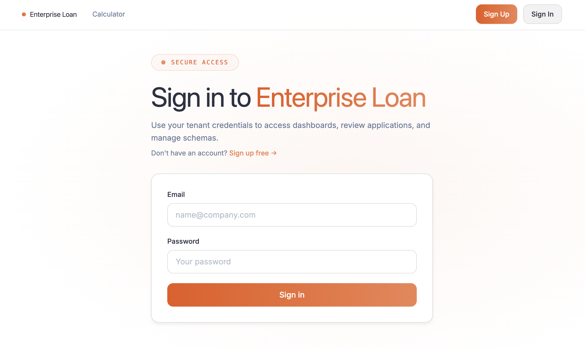
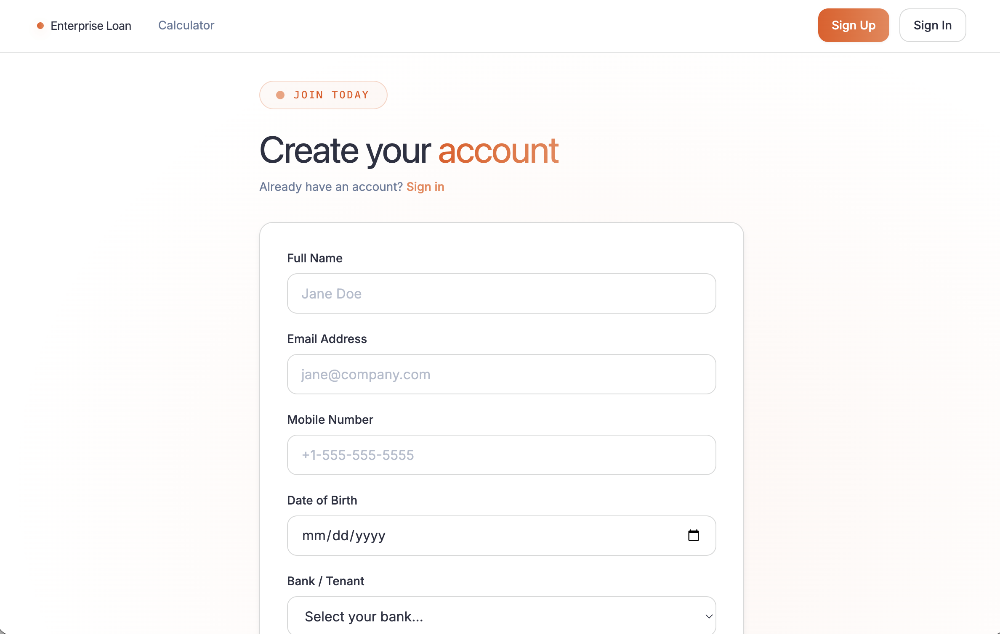
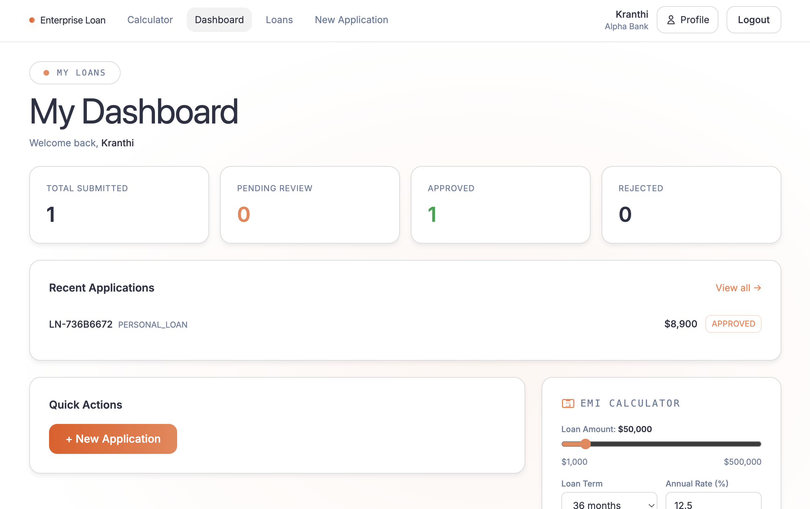
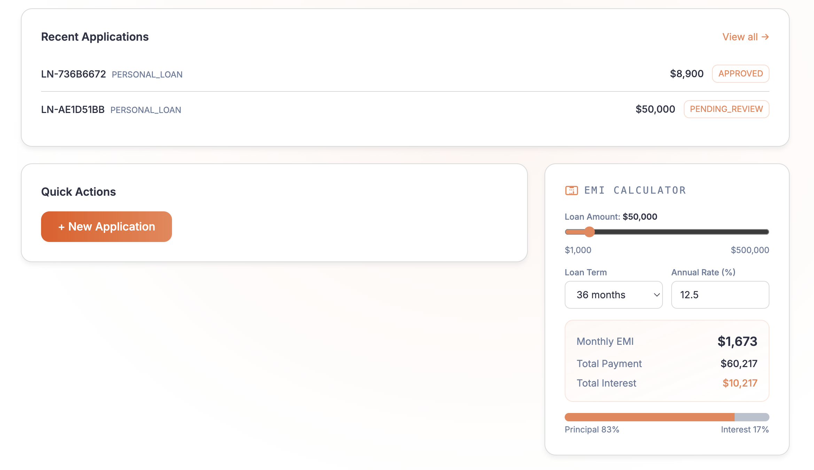
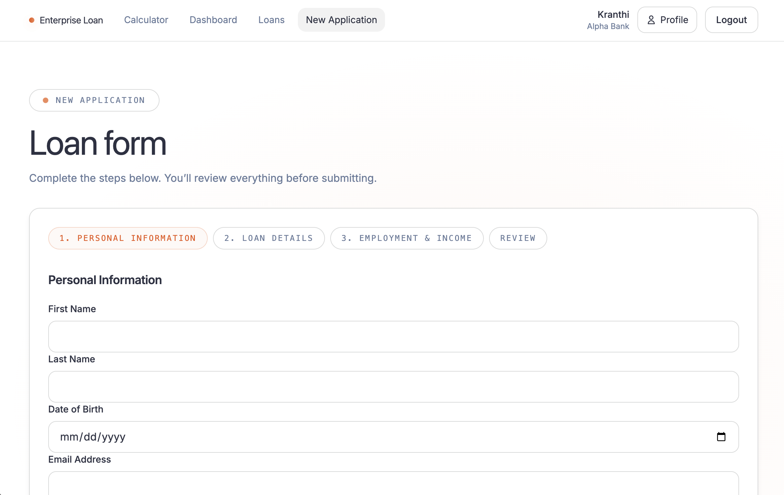
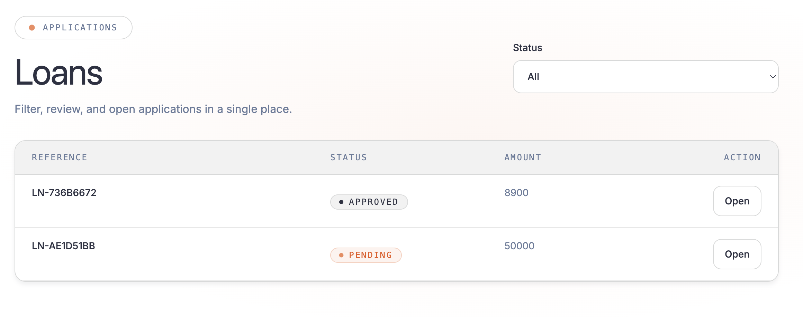
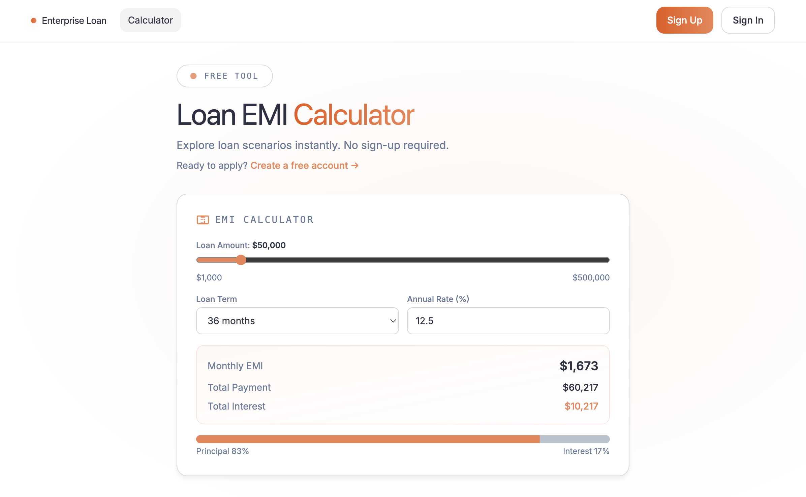
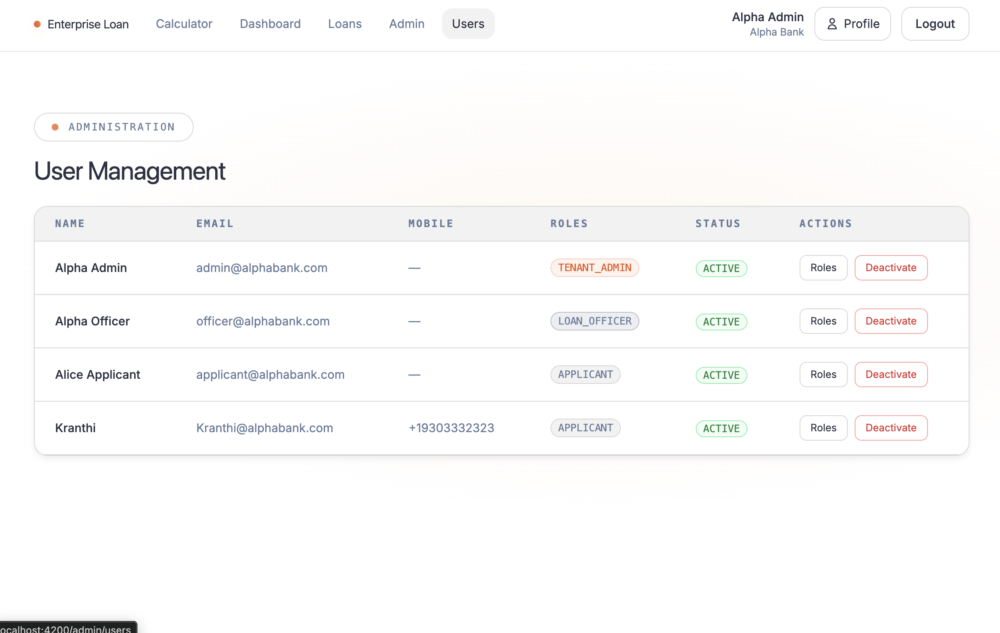
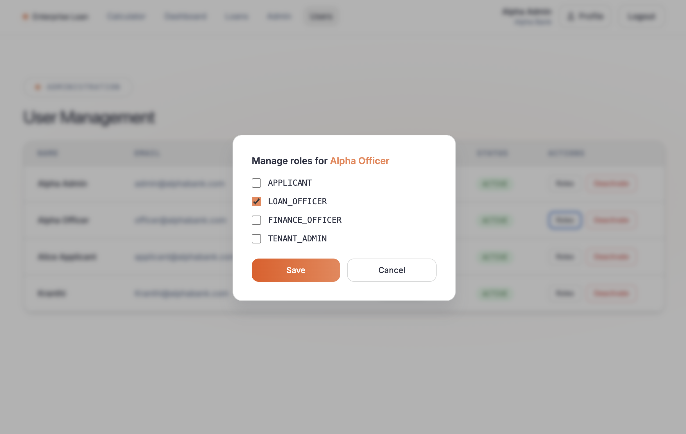
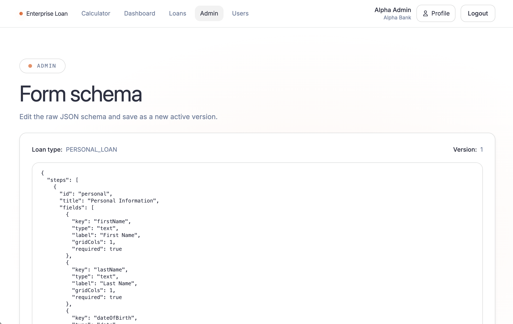

# 🖥️ Frontend — Angular 17 SPA
## Enterprise Loan Management Platform

This is the production-quality frontend for the Enterprise Loan Management platform, built with Angular 17. It features a completely dynamic, schema-driven form engine and a multi-tenant aware UI.

## 2. Frontend Tech Stack

| Tool | Version | Role |
| :--- | :--- | :--- |
| **Angular** | 17 | Core SPA framework |
| **TypeScript** | 5.4 | Strict mode, no any |
| **Angular Material** | latest | UI component library |
| **Angular CDK** | latest | Overlay, portal, a11y |
| **SCSS** | — | Component + global styles |
| **Angular Signals** | built-in | Local component state |
| **RxJS** | 7.x | HTTP streams, shared reactive state |
| **Angular Reactive Forms** | built-in | All forms; zero template-driven forms |
| **Angular HttpClient** | built-in | REST communication |
| **Nginx (Alpine)** | latest | Production static file server |
| **Node.js (build only)** | 20 | Docker build stage only |

## 3. How to Run (Local Development — without Docker)
```bash
cd frontend
npm install
npm start
# App available at http://localhost:4200
# Requires backend running at http://localhost:8080
```

## 4. How to Run (Docker)
```bash
# From project root:
docker-compose up --build frontend
```

## 5. Project Structure — Full Annotated Tree

```text
src/app/
├── app.config.ts              ← Bootstrap config: providers, router, HTTP client
├── app.routes.ts              ← All route definitions with guards
│
├── core/
│   ├── models/
│   │   └── index.ts           ← All TypeScript interfaces: User, Tenant, LoanApplication,
│   │                             FormSchema, FormField, WorkflowStep, AuditLog, etc.
│   ├── services/
│   │   ├── auth.service.ts    ← Login, signup, logout, token storage, role helpers
│   │   ├── tenant.service.ts  ← Loads tenant config (colors, interest rate, logo)
│   │   ├── dynamic-form.service.ts  ← Builds FormGroup from JSON schema at runtime
│   │   └── loan-application.service.ts ← CRUD for loan applications
│   ├── interceptors/
│   │   ├── auth.interceptor.ts    ← Attaches Bearer token; handles 401 + refresh
│   │   └── error.interceptor.ts   ← Global error handler: 403 redirect, 500 toast
│   └── guards/
│       ├── auth.guard.ts          ← Redirects unauthenticated users to /login
│       └── role.guard.ts          ← Blocks routes based on JWT role claims
│
├── features/
│   ├── auth/
│   │   ├── login/
│   │   │   └── login.component.ts     ← Login form + link to /signup
│   │   └── signup/
│   │       └── signup.component.ts    ← Self-registration form
│   ├── profile/
│   │   └── profile.component.ts       ← View/edit profile + change password
│   ├── dashboard/
│   │   ├── dashboard.component.ts          ← Role-detecting shell
│   │   ├── applicant-dashboard.component.ts ← Applicant-only stats + repayment cards
│   │   └── officer-dashboard.component.ts  ← Officer/Admin stats + queue
│   ├── loan-application/
│   │   ├── loan-form/
│   │   │   └── loan-form.component.ts     ← Multi-step wizard from JSON schema
│   │   ├── loan-list/
│   │   │   └── loan-list.component.ts     ← Paginated, filterable applications table
│   │   └── loan-detail/
│   │       └── loan-detail.component.ts   ← View application + repayment info
│   └── admin/
│       ├── admin.component.ts             ← Tabbed admin shell
│       ├── admin-users.component.ts       ← User list + role management
│       └── admin-schema.component.ts      ← JSON schema editor per loan type
│
└── shared/
    └── components/
        ├── navbar.component.ts            ← Top navigation, role-aware links
        ├── dynamic-field.component.ts     ← Renders any field type from schema
        ├── status-badge.component.ts      ← Colored status pill (DRAFT, APPROVED, etc.)
        ├── loan-calculator.component.ts   ← EMI calculator widget (public + dashboard)
        └── repayment-card.component.ts    ← Per-loan outstanding balance card
```

## 6. Screen-by-Screen UI Documentation

### Screen 1: Login Page (`/login`)
- **Access:** Public (unauthenticated)
- **Layout:** Centered card with tenant logo placeholder, email + password fields, "Sign In" button, link to "Create an account" (`/signup`), link to "Try our Loan Calculator" (`/calculator`)
- **Actions:** Submit triggers `POST /api/v1/auth/login`; on success stores JWT pair in localStorage, navigates to `/dashboard`; on failure shows inline error alert with `role="alert"`
- **Tenant context:** Tenant is resolved from the JWT after login; login is tenant-neutral at form level (email uniqueness is per-tenant).



---

### Screen 2: Sign-Up Page (`/signup`)
- **Access:** Public (unauthenticated)
- **Layout:** Multi-field registration form with: Full Name, Email, Mobile Number (with format hint), Date of Birth, Tenant/Bank selector (dropdown), Password, Confirm Password.
- **Validations:** email format, DOB minimum age 18, password strength indicator, password match cross-field error.
- **Actions:** Submit → `POST /api/v1/auth/signup`; on success redirects to `/login`.



---

### Screen 3: Applicant Dashboard (`/dashboard` — APPLICANT role)
- **Access:** Authenticated, APPLICANT role only.
- **Layout:** 
  - Summary stat cards for application status counts.
  - Active Loan Repayment Cards showing balance, EMI, and interest.
  - Sidebar: EMI Calculator widget.
- **API calls:** `GET /api/v1/applications` (scoped to user).


*(Note: Summary view with recent applications and EMI calculator widget)*


---

### Screen 4: Officer / Admin Dashboard (`/dashboard` — LOAN_OFFICER / TENANT_ADMIN)
- **Access:** Authenticated, officer or admin roles.
- **Layout:** Application status stats and "Applications Awaiting Review" table.
- **Actions:** View, Approve, Reject (role-gated).


---

### Screen 5: Loan Application Form (`/loans/new?type=PERSONAL_LOAN`)
- **Access:** Authenticated, APPLICANT.
- **Layout:** Multi-step wizard with fields rendered dynamically from the JSON schema.
- **Engine:** `DynamicFormService` handles conditional logic (show/hide/require) on `valueChanges`.



---

### Screen 6: Loan List (`/loans`)
- **Access:** Authenticated, all roles.
- **Layout:** Filterable, paginated table showing all relevant loan records.



---

### Screen 7: Loan Detail (`/loans/:id`)
- **Access:** Authenticated.
- **Layout:** Comprehensive view of the application data with repayment summaries for disbursed loans. Officers get an action panel for status updates.

---

### Screen 8: Profile Page (`/profile`)
- **Access:** Authenticated, any role.
- **Layout:** Editable profile information and password update section.

---

### Screen 9: Loan Calculator (`/calculator` — Public)
- **Access:** Public.
- **Layout:** Interactive sliders and inputs for live EMI calculation with bar charts for principal vs. interest.



---

### Screen 10: Admin — User Management (`/admin/users`)
- **Access:** TENANT_ADMIN only.
- **Layout:** User table with role editing and status toggling (Active/Inactive).


***

### Screen 13: Admin — Role Management Modal
- **Access:** TENANT_ADMIN only.
- **Layout:** Centered modal with checkboxes for each role (APPLICANT, LOAN_OFFICER, FINANCE_OFFICER, TENANT_ADMIN).



---

### Screen 11: Admin — Schema Editor (`/admin/schema`)
- **Access:** TENANT_ADMIN only.
- **Layout:** Raw JSON schema editor for configuring loan types on the fly.



---

### Screen 12: Navbar (Shared Component)
- **Branding:** Primary color dynamically applied from `tenant.config_json.primaryColor` via CSS custom properties.

## 7. Key Angular Patterns

*   **Standalone Components:** No `NgModules`; every component uses `standalone: true`.
*   **Signals for State:** Efficient reactivity using `signal`, `computed`, and `effect`.
*   **Dynamic Form Engine:** `DynamicFormService.buildFormGroup(schema)` iterates JSON to produce a `FormGroup`.
*   **Functional Interceptors:** HTTP logic handled via `HttpInterceptorFn`.
*   **takeUntilDestroyed:** Subscriptions are automatically cleaned up to prevent memory leaks.

## 8. Conditional Logic Engine

The engine supports:
- **Operators:** `eq`, `neq`, `gt`, `lt`, `contains`
- **Actions:** `show`, `hide`, `require`, `disable`

## 9. EMI Calculation Formula
```text
r = annualInterestRate / 1200        // monthly rate
n = loanTermMonths
EMI = P × r × (1 + r)^n / ((1 + r)^n − 1)
Total Payment = EMI × n
Total Interest = Total Payment − P
```

## 10. Accessibility Standards
- WCAG AA compliant color contrast (4.5:1).
- ARIA labels and `role="alert"` for real-time validation.
- Focus trapping in modals using Angular CDK.
